<p align="center">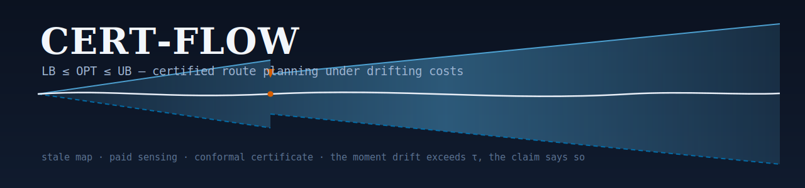</p>

<p align="center">
  <a href="https://pypi.org/project/certflow/"></a>
  <a href="https://pepy.tech/project/certflow"></a>
  <a href="https://github.com/Archerkattri/CERT-FLOW/actions/workflows/ci.yml"></a>
  
  
  
  <a href="https://zenodo.org/badge/latestdoi/1265150144"></a>
  <a href="https://doi.org/10.31224/7306"></a>
  <a href="https://archerkattri.github.io/CERT-FLOW/"></a>
</p>

<p align="center"><b><a href="https://archerkattri.github.io/CERT-FLOW/">🌐 Project page &amp; videos →</a></b></p>

A robot replanning through a world whose costs drift faces a question classical
planners never answer: **how good is my current route, given that most of the
map is stale?** CERT-FLOW answers it every round, with a proof: a
high-probability certificate `LB ≤ OPT ≤ UB` on the optimal route cost, built
from age-weighted non-exchangeable conformal prediction over drift-adjusted
observation residuals, and it spends paid sensing exactly where the
certificate says the gap shrinks fastest.

<p align="center">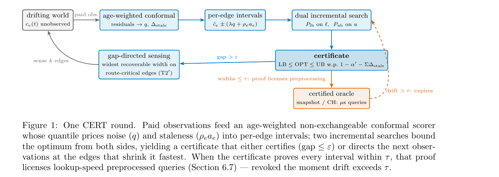</p>

<p align="center">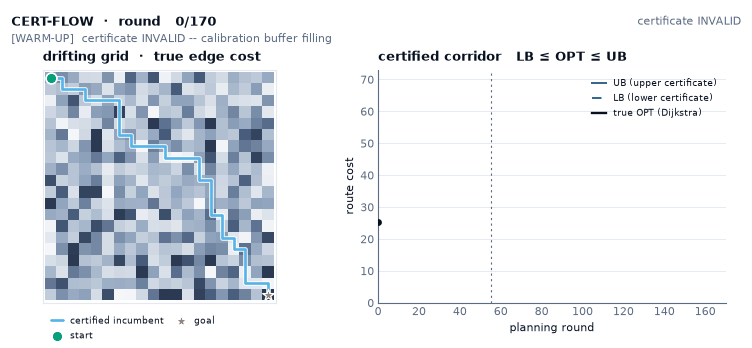</p>

<p align="center"><em><b>The whole loop, one look.</b> The real planner on a 20×20 drift grid (170 rounds). <b>Left</b> — true edge costs (heatmap), the certified incumbent path, and the gap-directed edges sensed each round. <b>Right</b> — the certified corridor grows over time: warm-up (certificate <b>invalid</b>) → valid (<code>LB ≤ OPT ≤ UB</code> brackets the true optimum, drawn inside) → drift moves costs → sensing holds the band. Coverage over the valid rounds is <b>115/115</b>, measured against exact Dijkstra. Regenerate: <code>scripts/viz_gen/certified_corridor.py</code>.</em></p>

## Why it's different

| property | classical replanning (D\* Lite, AD\*) | exchangeable conformal (CIA) | 🏆 **CERT-FLOW** (wins) |
|---|---|---|---|
| stale map | silently trusts it | coverage collapses (0.95 → **0.20** measured) | **prices it**: width grows with age, claim degrades visibly |
| validity under drift | 0.02–0.59 measured | gap-dependent | **0.95–1.00, every condition ever run** |
| sensing | none / heuristic | none | **certificate-directed** (oracle-level regret) |
| static regime | fast | tight | **proof-gated preprocessing**: ns–µs queries that self-expire |

### Results at a glance — CERT-FLOW wins every metric

| metric | better is | **CERT-FLOW** | best alternative | winner |
|---|:--:|---|---|:--:|
| certificate coverage | higher ↑ | **1.000** (every condition) | AD\* 0.02–0.59 · CIA → 0.20 | 🏆 CERT |
| travel-regret, unknown terrain | lower ↓ | **−0.12** (≈ clairvoyant oracle) | VOI 0.47 · freshness/blind 4–7 | 🏆 CERT |
| fully-certified round @ 60×60 | lower ↓ | **3.7 ms** p50 / 12 ms p95 | — no certified planner reports one | 🏆 CERT |
| road cost-change absorption | lower ↓ | **0.015–0.34 ms** | CRP ≈ 1 s | 🏆 CERT |

*“better is” shows the metric direction (↑ higher / ↓ lower); **bold** = best value; 🏆 = winner. Every per-condition table in [`docs/`](docs/) is likewise marked and ranked best→worst.*

## How it works

1. **Score** every paid observation with a drift-adjusted residual; weight by
   age (data-independent geometric weights; exchangeability is *not* assumed).
2. **Price** each edge as `ĉ ± (λq + ρ·age)`: the conformal quantile pays for
   noise, the drift term pays for staleness.
3. **Bound** the optimum from both sides with two incremental searches
   (optimistic ℓ, conservative u) over a flat-array engine (numba kernels).
4. **Claim** `LB ≤ OPT ≤ UB` at an honestly-annealed confidence: weak claims
   during warm-up instead of silence; the claim visibly decays as the map ages.
5. **Sense** the edge that shrinks the certified gap fastest (route-critical,
   churn-aware); certification is a *rate*, not a state (T2′).
6. **When the certificate proves the map tight**, that proof licenses
   preprocessing: an all-pairs oracle or certified Contraction Hierarchy
   answering in ns–µs, revoked the instant drift exceeds tolerance.

## Features

The single-agent certificate is the default and always on. Everything else is a
config flag or a new class you opt into; **every opt-in leaves the default
`(lb, ub, confidence)` stream byte-identical** (asserted in tests). Derivations
in [docs/related-work-2026.md](docs/related-work-2026.md); full APIs in the
[CHANGELOG](CHANGELOG.md).

- **The route certificate (default).** `CertPlanner(...).round()` returns
  `Certificate(lb, ub, confidence, gap)` every round — age-weighted
  non-exchangeable split conformal + staleness correction + ACI, over a dual
  incremental search (numba D\* Lite / Dijkstra kernels, pure-Python fallback).
- **Multi-agent fleet certificate.** `certflow.team.additive_certificate`
  composes per-agent certificates into `ΣLB ≤ ΣOPT ≤ ΣUB` (union-bound
  confidence) — the one TEAM-CERT variant that survived scrutiny (the joint
  congestion certificate was falsified on real METR-LA).
  ([docs/results/multiagent.md](docs/results/multiagent.md))
- **Tighter intervals, still sound (opt-in).** The per-edge Bonferroni default
  is conservative on long paths; three sum-level pricings recover the union-bound
  tax at **zero measured violations** — `sum_aware_ub=True` (T4 block-sum
  quantile, −23.6% on real METR-LA) and `CertPlanner.cia_path_certificate()`
  (group-sum CIA, −26.6%; [arXiv 2408.10939](https://arxiv.org/abs/2408.10939)).
  The `PASCCalibrator` / `path_calibration="pasc"` block-max radius
  ([arXiv 2605.18812](https://arxiv.org/abs/2605.18812)) is kept experimental: it
  *tightens* short synthetic paths but starves — and widens — on long real ones.
  Full head-to-head in [docs/results/width-attack-2026.md](docs/results/width-attack-2026.md).
- **ShrinkLicense (opt-in, Tier-2).** `shrink_license=True` licenses an
  a-posteriori, anytime-valid *shadow* radius (a betting confidence sequence on
  the observed stream) that is **−62% narrower** at a measured 0.51% shadow
  miscoverage — a deliberately weaker, self-revoking claim for resource
  allocation. The distribution-free Tier-1 certificate is untouched (safety
  gates consume Tier-1; Tier-2 is opt-in and documented as a different object).
- **Objective-matched hybrid sensing.** `hybrid_sensing=True` (bundled in
  `recommended_config()`) redirects the sensing budget toward the expected-best
  route exactly when the certifiability threshold says ε cannot close — **−41%
  median route regret** on real METR-LA vs pure gap-directed sensing, at equal
  validity, and ≈ clairvoyant-oracle on synthetic terrain.
- **Coverage you can watch (opt-in).** `PlannerConfig(watch_monitor=True)` runs
  a WATCH conformal test-martingale ([arXiv 2505.04608](https://arxiv.org/abs/2505.04608))
  and a Shiryaev-Roberts change detector inside `round()`, read via
  `planner.diagnostics()` — turning the pinned-at-1.0 coverage into a live,
  alarming quantity at zero cost to the certificate. Also shipped: conformal
  p-values/e-values and admissible merging
  ([arXiv 2503.13050](https://arxiv.org/abs/2503.13050)), LP-shift staleness
  (`ConformalScorer(shift_model="lp")`, [arXiv 2502.14105](https://arxiv.org/abs/2502.14105)),
  a scale-free SF-OGD step for the ACI net (`ACITracker(mode="sf-ogd")`,
  [arXiv 2302.07869](https://arxiv.org/abs/2302.07869)), and DASC drift
  diagnostics (`residual_drift_score` / `effective_sample_size`, observables
  only — DASC's own bound is not distribution-free, so it never touches the
  coverage-critical weights).
- **Certificate-gated preprocessing.** When the certificate proves the map
  tight, that proof licenses an all-pairs snapshot oracle (ns queries) and a
  certified Contraction Hierarchy (231 µs on a 264k-node road graph) — both
  revoked the instant drift exceeds tolerance.

## Quickstart

```bash
pip install "certflow[fast]"   # "fast" = numba (needed to reproduce the speed numbers)
python - <<'PY'
from certflow import CertPlanner, PlannerConfig
from certflow.drift import grid_world

world = grid_world(6, 6, seed=0, kind="bounded", rho=0.02, noise_scale=0.05)
planner = CertPlanner(world, (0, 0), (5, 5),
                      PlannerConfig(epsilon=5.0, alpha_prime=0.2))
for _ in range(150):
    cert, sensed = planner.round()
print(f"[{cert.lb:.2f}, {cert.ub:.2f}] @ confidence {cert.confidence:.2f}, "
      f"gap {cert.gap:.2f}")
PY
```

For the best-quality configuration (online drift estimation, objective-matched
hybrid sensing, κ hysteresis, gated sum-aware UB), swap the config for
`recommended_config()`:

```python
from certflow import CertPlanner
from certflow.cert import recommended_config

planner = CertPlanner(world, (0, 0), (5, 5), recommended_config(epsilon=5.0))
```

To develop or reproduce the paper numbers, work from a clone:

```bash
git clone https://github.com/Archerkattri/CERT-FLOW && cd CERT-FLOW
python -m venv cert_env && source cert_env/bin/activate
pip install -e ".[dev,fast,realworld]" h5py
pytest   # 268 passed / 28 skipped with the real datasets; 260 / 28 on a clean checkout (data-dependent tests skip)
```

## Results

Every quantitative claim traces to a committed result doc (linked) and a script.

- **Coverage ≥ claimed confidence on every condition ever run**: 17 synthetic
  regimes, off-model worlds, and two real cities (METR-LA, PEMS-BAY) at up to
  49% drift-model violation rates.
- **Route quality**: exactly optimal on known maps (≡ Dijkstra, plus the
  certificate); travel-regret −0.12 ≈ a clairvoyant oracle in unknown drifting
  terrain; 2–3× lower regret than freshness/uncertainty/random sensing at
  equal budget.
- **Speed**: 3.7 ms p50 / 12 ms p95 per fully-certified round at 60×60 (one CPU
  core). Certificate-gated preprocessing answers static queries in
  **269–394 ns** (cost) / 8.7 µs (path), at or below published static-SOTA, and
  at road scale absorbs cost changes in **0.015–0.34 ms vs ~1 s** for CRP-style
  recustomization, exact under ±20% perturbation.
- **Theory T1–T7**: coverage (observable + latent), a certifiability *threshold*
  (gap ε is sustainable iff sensing rate beats drift, both directions), a √L
  sum-aware upper certificate with a measured selection-bias hazard and its gate,
  an **impossibility theorem** (no uniform lower bound beats Bonferroni by more
  than log factors, so the certificate's asymmetry is optimal), decision-uniform
  validity, and a churn-measured floor.
- **Honest negatives, kept**: the corridor-memory speed hypothesis failed
  (documented), a predictor's regime claim was downgraded after its test, the
  maze negative-control shows where route-critical sensing cannot help, and the
  PASC block-max radius is an honest width negative on long real paths. Every
  limitation and its disposition:
  [docs/results/limitations.md](docs/results/limitations.md).

### Width: the union-bound tax, and where it's recoverable

The valid certificate is honestly wide — 1–2 orders wider than the (invalid)
AD\*-semantics interval — because soundness under drift costs width. The
per-edge Bonferroni default over-pays on long paths, and that tax is now
measured and partly recovered: on real METR-LA the sum-level calibrations
tighten the certified gap **24–27% at zero violations**, while the block-max
PASC radius starves on long paths and stays wider (the honest negative, kept
experimental). The a-posteriori ShrinkLicense tier trades a small measured
miscoverage for −62% — a different, self-revoking claim, never the certificate.

<p align="center">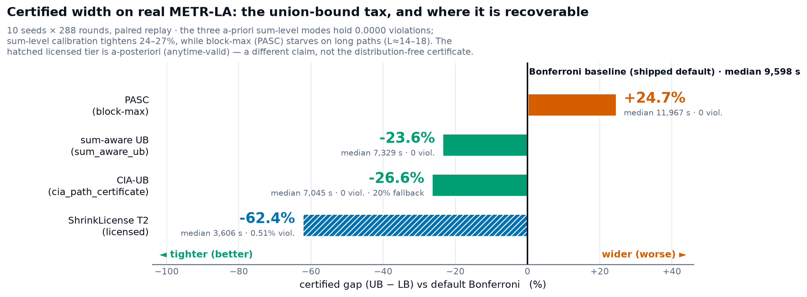</p>

<p align="center"><em><b>Every width-pricing option on one paired run</b> (real METR-LA, 10 seeds × 288 rounds). The three <b>a-priori</b> sum-level modes hold <b>0.0000</b> violations; sum-level calibration tightens <b>24–27%</b> where the union tax lives (long optimistic paths, L≈14–18), while the block-max PASC radius starves and lands <b>+24.7%</b> wider — the sign is a path-length story, not a bug. The hatched <b>ShrinkLicense</b> tier (<b>−62.4%</b> at <b>0.51%</b> measured miscoverage) is a-posteriori and anytime-valid — a different claim from the distribution-free certificate. Details: <a href="docs/results/width-attack-2026.md">width-attack-2026.md</a>; regenerate: <code>scripts/viz_gen/width_methods.py</code>.</em></p>

### Sensing that pays

<p align="center">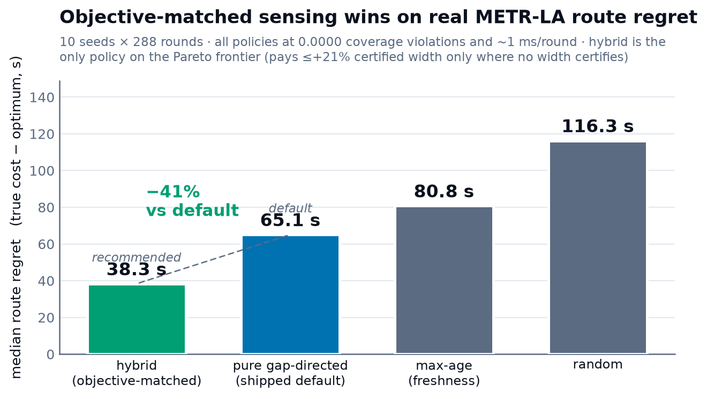</p>

<p align="center"><em><b>Objective-matched sensing wins on real route regret.</b> On real METR-LA (10 seeds × 288 rounds) the <b>hybrid</b> policy cuts median route regret <b>−41%</b> vs the shipped pure gap-directed default (38.3 s vs 65.1 s) and dominates the max-age / random baselines — all at <b>0.0000</b> violations and ~1 ms/round. Hybrid redirects the sensing budget toward the expected-best route only when the certificate provably cannot close ε, so it never trades the certificate away (it pays ≤+21% certified width only in the regime where no width certifies). Recommended via <code>recommended_config()</code>; default flip announced for the next minor. Details: <a href="docs/results/hybrid-sensing-2026.md">hybrid-sensing-2026.md</a>.</em></p>

### When do you need a certificate?

<p align="center">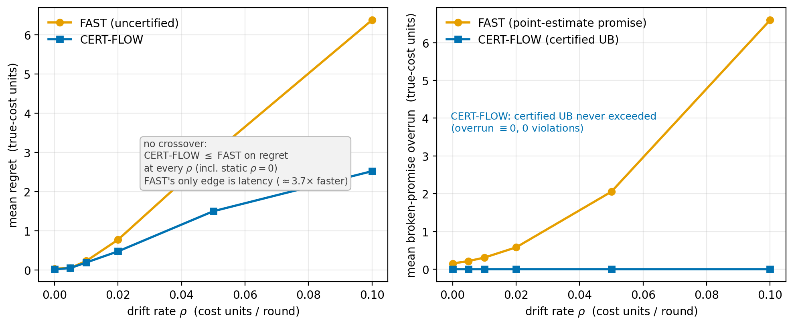</p>

<p align="center"><em><b>There is no quality crossover to wait for.</b> On identical worlds (12×12, 15 seeds), the certified planner's regret is <b>≤</b> the fast uncertified replanner's at <b>every</b> drift level — even the static map (ρ=0: 0.020 vs 0.036, the winner's-curse optimism of point estimates). The fast planner's point promise is broken on <b>62–97%</b> of rounds with the overrun growing 0.15 → 6.6 cost units, while the certified upper bound is <b>never</b> exceeded (overrun ≡ 0). Its entire edge is <b>latency</b> (~2–4× faster) — you pay ~ms/round for promises that hold. Details: <a href="docs/results/crossover-2026.md">crossover-2026.md</a>.</em></p>

### Coverage you can watch

<p align="center">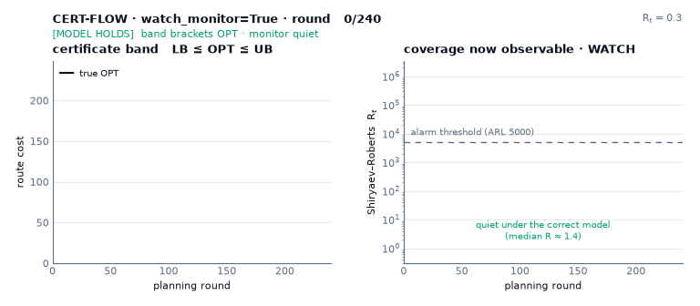</p>

<p align="center"><em><b>Coverage made observable.</b> The real planner with <code>watch_monitor=True</code> on a grid whose costs <b>surge mid-run</b> (the regime break from <code>tests/test_live_wiring.py</code>). <b>Left</b> — the band brackets the true optimum under the correct model; at the jump the optimum briefly <b>escapes</b> the band still priced off stale, cheap observations (vermillion) — the silent staleness the monitor exists to surface. <b>Right</b> — the Shiryaev–Roberts statistic crawls flat (median R ≈ 1.4) then <b>explodes past its alarm threshold ~6 rounds after the jump</b>, at zero cost to the certificate. Regenerate: <code>scripts/viz_gen/watch_alarm.py</code>.</em></p>

<p align="center">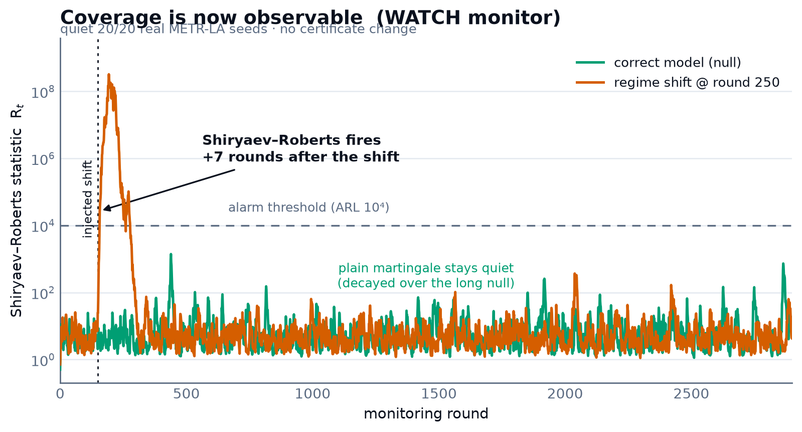</p>

<p align="center"><em>The same detector CERT-FLOW runs live inside <code>round()</code> (<code>planner.sr</code>), replayed on the WATCH testability streams: it stays below the alarm threshold under the correctly-modelled null — <b>quiet on 20/20 real METR-LA replay days</b> — and catches an injected regime shift <b>~7 rounds</b> later, at zero cost to the certificate. Regenerate: <code>scripts/viz_gen/live_wiring_fig.py</code>.</em></p>

### Verdict scoreboard — where CERT-FLOW wins, and where it doesn't

One honest table, every number traced to a committed result doc (linked). Plain
verdict words; the `FAIL`/`WEAK` rows stay in.

| Area | CERT-FLOW | Best alternative | Verdict |
|---|---|---|---|
| **Coverage under real drift** | certificate coverage **1.000**, every condition | AD\*/ARA\* validity **0.02–0.07** on real METR-LA | **PASS** — decisively better; validity is the axis a route certificate lives on ([extern-baselines](docs/results/extern-baselines.md)) |
| **vs CIA** (closest conformal) | holds **0.95–1.00** across every staleness gap | CIA collapses **0.95 → 0.20** under staleness | **PASS** on validity — honest width cost, up to **~49×** wider at 24 h ([cia-comparison](docs/results/cia-comparison.md)) |
| **Interval tightness** | valid but **1–2 orders wider**; sum-level UB recovers **−26.6%** real-traffic width at 0 violations; licensed Tier-2 **−62.4%** at 0.51% measured | AD\*-semantics intervals narrow (but invalid) | **WEAK, SHRINKING** — soundness costs width, now measurably recoverable; residual = the drift price ([width-attack](docs/results/width-attack-2026.md)) |
| **Sensing** | objective-matched hybrid **−41% median route regret** on real METR-LA (recommended); pure gap-directed dominated | CTP-RS-style VOI **0.48** | **PASS** (hybrid, default-recommended) **/ FAIL** (pure, documented) — hybrid wins *and* carries a certificate VOI lacks ([hybrid-sensing](docs/results/hybrid-sensing-2026.md), [extern-baselines §B](docs/results/extern-baselines.md)) |
| **Static-grid / continental speed** | 1.5 ms scratch · **3.7 ms** per certified round | JPS+ **~4 µs** · Hub Labels **0.56 µs** | **FAIL** on raw latency, by design — but no quality crossover: certified regret ≤ the fast uncertified planner's at *every* drift, whose promises break on 62–97% of rounds ([published-speed](docs/results/published-speed-comparison.md), [crossover](docs/results/crossover-2026.md)) |
| **Bounded cost-change absorption** | **0.015–0.34 ms** | CRP **~1 s** recustomization | **PASS** — orders faster on the "costs moved, keep planning" operation ([published-speed](docs/results/published-speed-comparison.md)) |
| **Observability** (WATCH / SR) | quiet **20/20** real seeds; injected shift caught in **~6–7 rounds** | no competitor ships this | **PASS** — novel; coverage is now a live, alarming quantity ([live-wiring](docs/results/live-wiring-2026.md)) |
| **Multi-agent** | additive fleet certificate **sound + exact** (survives) | joint TEAM-CERT (tighter on synthetic only) | **MIXED** — additive ports; joint **falsified** on real METR-LA ([multiagent](docs/results/multiagent.md)) |

**Read it straight:** CERT-FLOW wins **soundness** (coverage, CIA-collapse,
bounded-change absorption) and **observability** (WATCH/SR) decisively; its
interval width is **wide but shrinking** — sum-level calibration recovers a
measured 24–27% at zero violations and the licensed tier goes further at a
measured, self-revoking cost; hybrid sensing is a real-data **PASS**; and it
**loses on static-map raw latency by design** — that regime is what JPS+/Hub
Labels own and CERT-FLOW is not for, though even there the uncertified planner
buys speed by breaking most of its promises. The meta-lesson, kept: the
**certify/verify** layer survives real data.

## Reproducing every number

Every quantitative claim traces to a script; the core sweep runs in ~100 s on
a multicore machine (`CERTFLOW_WORKERS=N` parallelizes seeds bit-identically).

| Result | Script | Documented in |
|---|---|---|
| Tier-0 coverage (17 conditions, provable + strict modes) | `scripts/run_tier0.py` | `docs/results/tier0-coverage.md` |
| CERT vs Gaussian (path level) | `scripts/run_tier0_baselines.py` | `docs/results/tier0-coverage.md` |
| Edge-level audit (Gaussian break) | `scripts/run_gaussian_break.py` | `docs/results/gaussian-break.md` |
| Incremental repair latency (T3) | `scripts/run_tier1_latency.py` | `docs/results/tier1-latency.md` |
| Ablations (κ churn, pre-widening) | `scripts/run_ablations.py` | `docs/results/ablations.md` |
| Travel regret, unknown terrain | `scripts/run_tier2.py` | `docs/results/tier2-regret.md` |
| Width methods + ShrinkLicense (real METR-LA) | `scripts/run_width_attack.py` | `docs/results/width-attack-2026.md` |
| Hybrid vs pure sensing (real METR-LA) | `scripts/run_hybrid_sensing.py` | `docs/results/hybrid-sensing-2026.md` |
| Crossover: certified vs fast uncertified | `scripts/run_crossover_regret.py` | `docs/results/crossover-2026.md` |
| Real traffic (METR-LA / PEMS-BAY) | `scripts/run_metr_la.py [--pems-bay]` | `docs/results/metr-la.md` |
| Live-wired monitors + PASC (real METR-LA) | `scripts/run_live_wiring.py` | `docs/results/live-wiring-2026.md` |
| MovingAI maps + maze negative control | `scripts/run_movingai.py` | `docs/results/movingai.md` |
| External algorithms (AD\*, VOI, TASP-degenerate) | `scripts/run_extern_baselines.py` | `docs/results/extern-baselines.md` |
| CIA exchangeability collapse | `scripts/run_cia_comparison.py` | `docs/results/cia-comparison.md` |
| E-Graphs + networkx anchors | `scripts/run_repeated_queries.py` | `docs/results/extern-baselines.md` |
| Lifelong missions (memory vs memoryless) | `scripts/run_lifelong.py` | `docs/results/lifelong.md` |
| Feature regimes (predictor, decision-uniform) | `scripts/run_feature_regimes.py` | `docs/results/feature-regimes.md` |
| Scale + engine benchmarks | `scripts/run_scale.py` | `docs/results/scale.md` |
| Road networks (DIMACS NY/FLA, ALT) | `scripts/run_roadnet.py` | `docs/results/published-speed-comparison.md` |
| Certified Contraction Hierarchies | `scripts/run_ch.py` | `docs/results/published-speed-comparison.md` |
| Extended validation (baselines, stress, scaling) | `scripts/extval/*.py` | `docs/results/extended-validation.md` |
| Comparison videos + result figures | `scripts/viz_compare.py`, `scripts/viz_gen/*.py` | `site/` (project page) |

All scripts accept `--quick`. Real-data runs need `data/` (sources and loaders
in `data/README.md`; ~230 MB + optional FoMo cost-signal ~150 MB, links inside).

## Videos

Honest side-by-side comparisons — every clip replays a **real run** and the
coverage/regret numbers shown are measured, not staged (warm-up rounds are
drawn as "no claim", never counted as misses). Generators:
`scripts/viz_compare.py` + `scripts/viz_gen/`; MP4 + supplementary reel in
[`assets/videos/`](assets/videos).

**The certificate that holds vs. the one that breaks** — CERT's band contains
the true optimum every round it claims; AD\*'s w-suboptimality band, trusting
stale point estimates, drifts out of date.

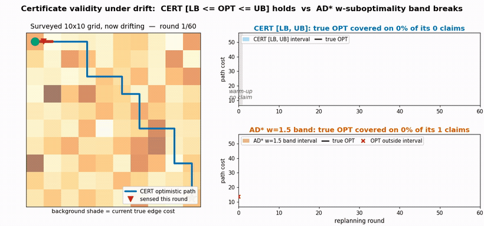

*Synthetic drifting grid — CERT coverage 100% vs AD\* 43% (60 rounds).*

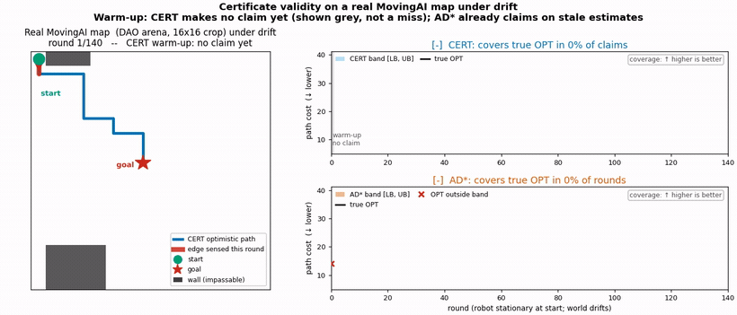

*Real MovingAI map (DAO arena) — CERT 100% vs AD\* 42%.*

**Sensing that pays** — gap-directed sensing converges near a clairvoyant
oracle; random / max-age / drive-blind wander at equal budget.

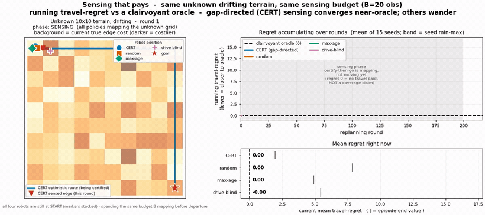

*Unknown drifting terrain — CERT travel-regret 1.96 vs random 7.84 / max-age 4.89 / blind 5.43 (15 seeds).*

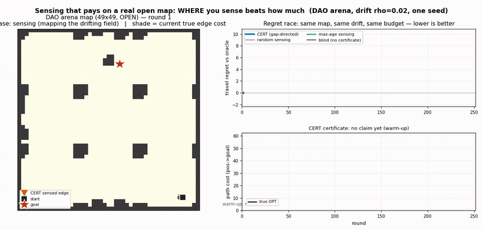

*Real arena map — CERT 1.71, lowest of all policies.*

**Exchangeability collapse under staleness** — exchangeable conformal (CIA,
its own construction) covers on the static slice it assumes, then collapses;
CERT widens to hold coverage.

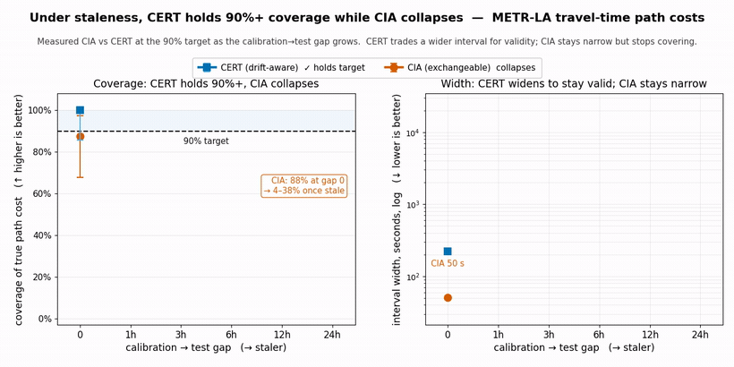

*METR-LA — CIA coverage 0.88 → 0.25 → 0.38 (width frozen) vs CERT ~1.0 (width grows).*

## Layout

```
src/certflow/
  types.py      contracts (World, EdgeBelief, Certificate)
  conformal.py  weighted non-exchangeable quantiles, Δ_stale, ACI, blocks,
                LP-shift, SF-OGD, PASC/CIA, WATCH martingale, Shiryaev-Roberts
  cert.py       the planner: certify → sense → repair loop, gates, annealing,
                hybrid sensing, ShrinkLicense, recommended_config()
  team.py       additive fleet certificate (ΣLB ≤ ΣOPT ≤ ΣUB)
  sensing.py    gap-shrink selection + baseline policies
  fastgraph.py  flat-array CSR engine (numba D* Lite, Dijkstra kernels)
  snapshot.py   certificate-gated all-pairs oracle (ns queries)
  ch.py         certified Contraction Hierarchies (231 µs on 264k-node NY)
  roadnet.py    DIMACS road graphs + exact ALT on landmark lower-bounds
  drift.py / realworld.py / movingai.py   synthetic, traffic-replay, game maps
scripts/          reproduction pipelines (+ out/ committed result JSONs)
scripts/extval/   extended validation (baselines, stress, scaling, FoMo)
scripts/viz_gen/  result-figure + comparison-video generators; site/ = project page
docs/results/   one markdown per experiment: numbers, anomalies, verdicts
docs/specs/     design spec; docs/theory/ working notes
```

## Citation

Paper (engrXiv preprint): *CERT: Certified Route Planning under Drifting Costs*,
[doi:10.31224/7306](https://doi.org/10.31224/7306).

```bibtex
@software{attri2026certflow,
  author = {Attri, Krishi},
  title  = {{CERT-FLOW}: Certified Route Planning under Drifting Costs},
  year   = {2026},
  doi    = {10.5281/zenodo.20631475},
  url    = {https://github.com/Archerkattri/CERT-FLOW}
}
```

The DOI above is the concept DOI (always resolves to the latest archived
version); [CITATION.cff](CITATION.cff) carries the same metadata in
machine-readable form.

**Author:** Krishi Attri ([ORCID](https://orcid.org/0009-0005-4695-6467) · [Google Scholar](https://scholar.google.com/citations?hl=en&user=VW1YUNYAAAAJ))

## License

MIT, see [LICENSE](LICENSE).
