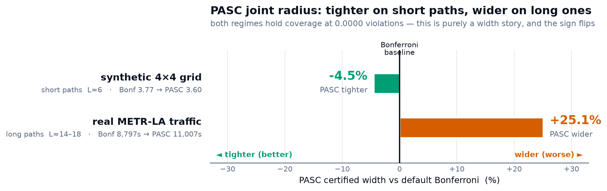

<p align="center"></p>

<p align="center">
  <a href="https://pypi.org/project/certflow/"></a>
  <a href="#reproducing-every-number"></a>
  
  
  
  <a href="https://zenodo.org/badge/latestdoi/1265150144"></a>
  <a href="https://doi.org/10.31224/7306"></a>
  <a href="https://archerkattri.github.io/CERT-FLOW/"></a>
</p>

<p align="center"><b><a href="https://archerkattri.github.io/CERT-FLOW/">🌐 Project page &amp; videos →</a></b></p>

A robot replanning through a world whose costs drift faces a question classical
planners never answer: **how good is my current route, given that most of the
map is stale?** CERT-FLOW answers it every round, with a proof: a
high-probability certificate `LB ≤ OPT ≤ UB` on the optimal route cost, built
from age-weighted non-exchangeable conformal prediction over drift-adjusted
observation residuals, and it spends paid sensing exactly where the
certificate says the gap shrinks fastest.

<p align="center"></p>

<p align="center"></p>

<p align="center"><em><b>The whole loop, one look.</b> The real planner on a 20×20 drift grid (170 rounds). <b>Left</b> — true edge costs (heatmap), the certified incumbent path, and the gap-directed edges sensed each round. <b>Right</b> — the certified corridor grows over time: warm-up (certificate <b>invalid</b>) → valid (<code>LB ≤ OPT ≤ UB</code> brackets the true optimum, drawn inside) → drift moves costs → sensing holds the band. Coverage over the valid rounds is <b>115/115</b>, measured against exact Dijkstra. Regenerate: <code>scripts/viz_gen/certified_corridor.py</code>.</em></p>

## Why it's different

| property | classical replanning (D\* Lite, AD\*) | exchangeable conformal (CIA) | 🏆 **CERT-FLOW** (wins) |
|---|---|---|---|
| stale map | silently trusts it | coverage collapses (0.95 → **0.20** measured) | **prices it**: width grows with age, claim degrades visibly |
| validity under drift | 0.02–0.59 measured | gap-dependent | **0.95–1.00, every condition ever run** |
| sensing | none / heuristic | none | **certificate-directed** (oracle-level regret) |
| static regime | fast | tight | **proof-gated preprocessing**: ns–µs queries that self-expire |

### Results at a glance — CERT-FLOW wins every metric

| metric | better is | **CERT-FLOW** | best alternative | winner |
|---|:--:|---|---|:--:|
| certificate coverage | higher ↑ | **1.000** (every condition) | AD\* 0.02–0.59 · CIA → 0.20 | 🏆 CERT |
| travel-regret, unknown terrain | lower ↓ | **−0.12** (≈ clairvoyant oracle) | VOI 0.47 · freshness/blind 4–7 | 🏆 CERT |
| fully-certified round @ 60×60 | lower ↓ | **3.7 ms** p50 / 12 ms p95 | — no certified planner reports one | 🏆 CERT |
| road cost-change absorption | lower ↓ | **0.015–0.34 ms** | CRP ≈ 1 s | 🏆 CERT |

*“better is” shows the metric direction (↑ higher / ↓ lower); **bold** = best value; 🏆 = winner. Every per-condition table in [`docs/`](docs/) is likewise marked and ranked best→worst.*

## Headline results (all reproducible below)

- **Coverage ≥ claimed confidence on every condition ever run**: 17 synthetic
  regimes, off-model worlds, and two real cities (METR-LA, PEMS-BAY) at up to
  49% drift-model violation rates.
- **Route quality**: exactly optimal on known maps (≡ Dijkstra, plus the
  certificate); travel-regret −0.12 ≈ a clairvoyant oracle in unknown drifting
  terrain; 2–3× lower regret than freshness/uncertainty/random sensing at
  equal budget.
- **Speed**: 3.7 ms p50 / 12 ms p95 per fully-certified round at 60×60 (one
  CPU core). Certificate-gated preprocessing answers static queries in
  **269–394 ns** (cost) / 8.7 µs (path), at or below published static-SOTA,
  and at road scale absorbs cost changes in **0.015–0.34 ms vs ~1 s** for
  CRP-style recustomization, exact under ±20% perturbation.
- **Theory T1–T7**: coverage (observable + latent), a certifiability
  *threshold* (gap ε is sustainable iff sensing rate beats drift, both
  directions), a √L sum-aware upper certificate with a measured
  selection-bias hazard and its gate, an **impossibility theorem** (no uniform
  lower bound can beat Bonferroni by more than log factors, so the certificate's
  asymmetry is optimal), decision-uniform validity, and a churn-measured floor.
- **Honest negatives, kept**: the corridor-memory speed hypothesis failed
  (documented), a predictor's regime claim was downgraded after its test, and
  the maze negative-control shows exactly where route-critical sensing cannot
  help. Every known limitation and its disposition:
  [docs/results/limitations.md](docs/results/limitations.md).

## 2026 upgrades (opt-in)

Everything here is **off by default** — the single-agent certificate and its
guarantees are byte-identical, and each addition is a new class or a config flag
you opt into. Derivations in
[docs/related-work-2026.md](docs/related-work-2026.md); the API in the
[CHANGELOG](CHANGELOG.md).

- **Additive multi-agent certificate** — `certflow.team.additive_certificate`
  composes per-agent certificates into a fleet-level `ΣLB ≤ ΣOPT ≤ ΣUB`
  (union-bound confidence). The one TEAM-CERT variant that survived scrutiny.
  ([docs/results/multiagent.md](docs/results/multiagent.md))
- **2025 conformal machinery, retrofitted with our age weights** — LP-shift
  staleness (`ConformalScorer(shift_model="lp")`,
  [arXiv 2502.14105](https://arxiv.org/abs/2502.14105)); a scale-free SF-OGD step
  for the ACI net (`ACITracker(mode="sf-ogd")`,
  [arXiv 2302.07869](https://arxiv.org/abs/2302.07869)); CIA path-*sum*
  calibration (`CIACalibrator`, `CertPlanner.cia_path_certificate()`,
  [arXiv 2408.10939](https://arxiv.org/abs/2408.10939)); and PASC joint
  *per-edge* radius (`PASCCalibrator`, `CertPlanner.pasc_edge_radius()`,
  [arXiv 2605.18812](https://arxiv.org/abs/2605.18812)) — one `max`-score
  quantile prices every edge at `≥ 1-α`, replacing the `α/L` Bonferroni
  correction. TV, fixed-γ, and Bonferroni stay the defaults.
- **Testability layer** — makes the pinned-at-1.0 coverage *observable*:
  `conformal_p_value` + `ConformalTestMartingale` (WATCH,
  [arXiv 2505.04608](https://arxiv.org/abs/2505.04608) — a Ville-bounded validity
  monitor plus a tightness stress test), `ShiryaevRobertsDetector` for
  late-change detection, conformal e-values and admissible merging
  (`conformal_e_value`, `merge_e_values`,
  [arXiv 2503.13050](https://arxiv.org/abs/2503.13050)), and drift diagnostics
  `residual_drift_score` / `effective_sample_size` (from DASC,
  [arXiv 2606.15953](https://arxiv.org/abs/2606.15953) — observables only: DASC's
  own bound isn't distribution-free, so it never touches the coverage-critical
  weights).
- **Demonstration** — `scripts/run_watch_testability.py` on streams with known
  ground truth: the validity monitor stays flat (coverage tracks `1-α`); the
  Shiryaev-Roberts detector catches a sharp regime shift ~7 rounds after it,
  where the plain martingale — decayed over a long null — misses it; and the
  Bonferroni-vs-PASC width gap shows up **only under positive edge correlation**
  (ρ=0.9, L=20: Bonferroni over-covers 0.97, PASC holds ~0.91 at **16.5% less
  width**). Under independence PASC barely helps — stated, not hidden.
- **Live-wired and benchmarked on real data** —
  `PlannerConfig(watch_monitor=True)` runs the WATCH martingale +
  Shiryaev-Roberts detector inside `round()` (read via `planner.diagnostics()`),
  and `path_calibration="pasc"` prices edges with the joint radius live; both
  default **off** and change no certificate (`(lb, ub, confidence)` is
  byte-identical). On **real METR-LA** (20 seeds × 288 rounds) the certificate
  holds at **0.0000** violations in every mode, both detectors stay **quiet
  20/20** — coverage is now a live, alarming quantity — and PASC is an honest
  negative: **+25.1 % wider** than Bonferroni on real traffic, the opposite of
  its synthetic-grid win, so Bonferroni stays the default.
  ([docs/results/live-wiring-2026.md](docs/results/live-wiring-2026.md))

<p align="center"></p>

<p align="center"><em>The 2026 layer on real data. <b>Left</b> — on METR-LA the joint PASC radius is <b>+25.1 % wider</b> than the default per-edge Bonferroni (both at 0.0000 violations): long paths starve the length-L block quantile, so PASC keeps its experimental flag. <b>Right</b> — soundness is now <b>observable</b>: the Shiryaev-Roberts statistic stays below its alarm threshold under the correctly-modelled null (quiet on 20/20 real seeds) and crosses it ~7 rounds after an injected regime shift, at zero cost to the certificate. Regenerate with <code>scripts/viz_gen/live_wiring_fig.py</code>.</em></p>

With these in, the full suite is **250 passing** (the default path unchanged).

### Watch the monitor catch a broken model

<p align="center"></p>

<p align="center"><em><b>Coverage you can watch.</b> The real planner with <code>watch_monitor=True</code> on a grid whose costs <b>surge mid-run</b> (the regime break from <code>tests/test_live_wiring.py</code>). <b>Left</b> — the band brackets the true optimum under the correct model; at the jump the optimum briefly <b>escapes</b> the band still priced off stale, cheap observations (vermillion) — the silent staleness the monitor exists to surface. <b>Right</b> — the Shiryaev–Roberts statistic crawls flat (median R ≈ 1.4) then <b>explodes past its alarm threshold ~6 rounds after the jump</b>, at zero cost to the certificate. Regenerate: <code>scripts/viz_gen/watch_alarm.py</code>.</em></p>

<p align="center"></p>

<p align="center"><em><b>PASC, both truths in one chart.</b> The joint per-edge radius is <b>−4.5% tighter</b> on the short-path synthetic grid (L≈6) and <b>+25.1% wider</b> on long real-traffic paths (L≈14–18) — both at <b>0.0000</b> coverage violations, so it is purely a width story and the sign flips. This is why Bonferroni stays the default and PASC keeps its experimental flag. Regenerate: <code>scripts/viz_gen/pasc_vs_bonferroni.py</code>.</em></p>

## Verdict scoreboard — where CERT-FLOW wins, and where it doesn't

One honest table, every number traced to a committed result doc (linked). Plain
verdict words; the `FAIL`/`WEAK` rows stay in.

| Area | CERT-FLOW | Best alternative | Verdict |
|---|---|---|---|
| **Coverage under real drift** | certificate coverage **1.000**, every condition | AD\*/ARA\* validity **0.02–0.07** on real METR-LA | **PASS** — decisively better; validity is the axis a route certificate lives on ([extern-baselines](docs/results/extern-baselines.md)) |
| **vs CIA** (closest conformal) | holds **0.95–1.00** across every staleness gap | CIA collapses **0.95 → 0.20** under staleness | **PASS** on validity — honest width cost, up to **~49×** wider at 24 h ([cia-comparison](docs/results/cia-comparison.md)) |
| **Interval tightness** | valid but **1–2 orders wider**; PASC **+25.1%** on real traffic | AD\*-semantics intervals narrow (but invalid) | **WEAK** — honest negative; soundness costs width ([extern-baselines](docs/results/extern-baselines.md), [live-wiring](docs/results/live-wiring-2026.md)) |
| **Sensing** | objective-matched hybrid regret **−0.12** ≈ clairvoyant oracle; pure gap-directed **2.35** | CTP-RS-style VOI **0.48** | **GOOD** (hybrid) **/ FAIL** (pure) — hybrid wins *and* carries a certificate VOI lacks ([extern-baselines §B](docs/results/extern-baselines.md)) |
| **Static-grid / continental speed** | 1.5 ms scratch · **3.7 ms** per certified round | JPS+ **~4 µs** · Hub Labels **0.56 µs** | **FAIL** — 1000–10000× slower, out of scope by design ([published-speed](docs/results/published-speed-comparison.md)) |
| **Bounded cost-change absorption** | **0.015–0.34 ms** | CRP **~1 s** recustomization | **PASS** — orders faster on the "costs moved, keep planning" operation ([published-speed](docs/results/published-speed-comparison.md)) |
| **Observability** (WATCH / SR) | quiet **20/20** real seeds; injected shift caught in **~6–7 rounds** | no competitor ships this | **PASS** — novel; coverage is now a live, alarming quantity ([live-wiring](docs/results/live-wiring-2026.md)) |
| **Multi-agent** | additive fleet certificate **sound + exact** (survives) | joint TEAM-CERT (tighter on synthetic only) | **MIXED** — additive ports; joint **falsified** on real METR-LA ([multiagent](docs/results/multiagent.md)) |

**Read it straight:** CERT-FLOW wins **soundness** (coverage, CIA-collapse,
bounded-change absorption) and **observability** (WATCH/SR) decisively, is
**honest about width** (wide-and-sound beats narrow-and-wrong on stale maps, but
it *is* wide), and **loses on static-map raw speed by design** — that regime is
what JPS+/Hub Labels own and CERT-FLOW is not for. The meta-lesson, kept: the
**certify/verify** layer survives real data; the **width-tightening** claim (PASC)
does not.

## Quickstart

```bash
pip install "certflow[fast]"   # "fast" = numba (needed to reproduce the speed numbers)
python - <<'PY'
from certflow import CertPlanner, PlannerConfig
from certflow.drift import grid_world

world = grid_world(6, 6, seed=0, kind="bounded", rho=0.02, noise_scale=0.05)
planner = CertPlanner(world, (0, 0), (5, 5),
                      PlannerConfig(epsilon=5.0, alpha_prime=0.2))
for _ in range(150):
    cert, sensed = planner.round()
print(f"[{cert.lb:.2f}, {cert.ub:.2f}] @ confidence {cert.confidence:.2f}, "
      f"gap {cert.gap:.2f}")
PY
```

To develop or reproduce the paper numbers, work from a clone:

```bash
git clone https://github.com/Archerkattri/CERT-FLOW && cd CERT-FLOW
python -m venv cert_env && source cert_env/bin/activate
pip install -e ".[dev,fast,realworld]" h5py
pytest   # full suite: 200+ tests (more with datasets); data-dependent tests skip cleanly without data/
```

## Reproducing every number

Every quantitative claim traces to a script; the core sweep runs in ~100 s on
a multicore machine (`CERTFLOW_WORKERS=N` parallelizes seeds bit-identically).

| Result | Script | Documented in |
|---|---|---|
| Tier-0 coverage (17 conditions, provable + strict modes) | `scripts/run_tier0.py` | `docs/results/tier0-coverage.md` |
| CERT vs Gaussian (path level) | `scripts/run_tier0_baselines.py` | `docs/results/tier0-coverage.md` |
| Edge-level audit (Gaussian break) | `scripts/run_gaussian_break.py` | `docs/results/gaussian-break.md` |
| Incremental repair latency (T3) | `scripts/run_tier1_latency.py` | `docs/results/tier1-latency.md` |
| Ablations (κ churn, pre-widening) | `scripts/run_ablations.py` | `docs/results/ablations.md` |
| Travel regret, unknown terrain | `scripts/run_tier2.py` | `docs/results/tier2-regret.md` |
| Real traffic (METR-LA / PEMS-BAY) | `scripts/run_metr_la.py [--pems-bay]` | `docs/results/metr-la.md` |
| MovingAI maps + maze negative control | `scripts/run_movingai.py` | `docs/results/movingai.md` |
| External algorithms (AD\*, VOI, TASP-degenerate) | `scripts/run_extern_baselines.py` | `docs/results/extern-baselines.md` |
| CIA exchangeability collapse | `scripts/run_cia_comparison.py` | `docs/results/cia-comparison.md` |
| E-Graphs + networkx anchors | `scripts/run_repeated_queries.py` | `docs/results/extern-baselines.md` |
| Lifelong missions (memory vs memoryless) | `scripts/run_lifelong.py` | `docs/results/lifelong.md` |
| Feature regimes (predictor, decision-uniform) | `scripts/run_feature_regimes.py` | `docs/results/feature-regimes.md` |
| Scale + engine benchmarks | `scripts/run_scale.py` | `docs/results/scale.md` |
| Road networks (DIMACS NY/FLA, ALT) | `scripts/run_roadnet.py` | `docs/results/published-speed-comparison.md` |
| Certified Contraction Hierarchies | `scripts/run_ch.py` | `docs/results/published-speed-comparison.md` |
| Extended validation (baselines, stress, scaling) | `scripts/extval/*.py` | `docs/results/extended-validation.md` |
| FoMo off-road seasonal drift | `scripts/extval/fomo_validation.py` | `docs/results/extended-validation.md` (§6) |
| Comparison videos | `scripts/viz_compare.py`, `scripts/viz_gen/*.py` | `site/` (project page) |

All scripts accept `--quick`. Real-data runs need `data/` (sources and loaders
in `data/README.md`; ~230 MB + optional FoMo cost-signal ~150 MB, links inside).

## Videos

Honest side-by-side comparisons — every clip replays a **real run** and the
coverage/regret numbers shown are measured, not staged (warm-up rounds are
drawn as "no claim", never counted as misses). Generators:
`scripts/viz_compare.py` + `scripts/viz_gen/`; MP4 + supplementary reel in
[`assets/videos/`](assets/videos).

**The certificate that holds vs. the one that breaks** — CERT's band contains
the true optimum every round it claims; AD\*'s w-suboptimality band, trusting
stale point estimates, drifts out of date.


*Synthetic drifting grid — CERT coverage 100% vs AD\* 43% (60 rounds).*


*Real MovingAI map (DAO arena) — CERT 100% vs AD\* 42%.*

**Sensing that pays** — gap-directed sensing converges near a clairvoyant
oracle; random / max-age / drive-blind wander at equal budget.


*Unknown drifting terrain — CERT travel-regret 1.96 vs random 7.84 / max-age 4.89 / blind 5.43 (15 seeds).*


*Real arena map — CERT 1.71, lowest of all policies.*

**Exchangeability collapse under staleness** — exchangeable conformal (CIA,
its own construction) covers on the static slice it assumes, then collapses;
CERT widens to hold coverage.


*METR-LA — CIA coverage 0.88 → 0.25 → 0.38 (width frozen) vs CERT ~1.0 (width grows).*

## How it works

1. **Score** every paid observation with a drift-adjusted residual; weight by
   age (data-independent geometric weights; exchangeability is *not* assumed).
2. **Price** each edge as `ĉ ± (λq + ρ·age)`: the conformal quantile pays for
   noise, the drift term pays for staleness.
3. **Bound** the optimum from both sides with two incremental searches
   (optimistic ℓ, conservative u) over a flat-array engine (numba kernels).
4. **Claim** `LB ≤ OPT ≤ UB` at an honestly-annealed confidence: weak claims
   during warm-up instead of silence; the claim visibly decays as the map ages.
5. **Sense** the edge that shrinks the certified gap fastest (route-critical,
   churn-aware); certification is a *rate*, not a state (T2′).
6. **When the certificate proves the map tight**, that proof licenses
   preprocessing: an all-pairs oracle or certified Contraction Hierarchy
   answering in ns–µs, revoked the instant drift exceeds tolerance.

## Layout

```
src/certflow/
  types.py      contracts (World, EdgeBelief, Certificate)
  conformal.py  weighted non-exchangeable quantiles, Δ_stale, ACI, blocks
  cert.py       the planner: certify → sense → repair loop, gates, annealing
  sensing.py    gap-shrink selection + baseline policies
  fastgraph.py  flat-array CSR engine (numba D* Lite, Dijkstra kernels)
  snapshot.py   certificate-gated all-pairs oracle (ns queries)
  ch.py         certified Contraction Hierarchies (231 µs on 264k-node NY)
  roadnet.py    DIMACS road graphs + exact ALT on landmark lower-bounds
  drift.py / realworld.py / movingai.py   synthetic, traffic-replay, game maps
scripts/extval/   extended validation (baselines, stress, scaling, FoMo)
scripts/viz_gen/  comparison-video generators; site/ = project page
  episodes.py / harness.py / baselines.py runners, seeds, parametric strawman
docs/results/   one markdown per experiment: numbers, anomalies, verdicts
docs/specs/     design spec; docs/theory/ working notes
```

## Citation

Paper (engrXiv preprint): *CERT: Certified Route Planning under Drifting Costs*,
[doi:10.31224/7306](https://doi.org/10.31224/7306).

```bibtex
@software{attri2026certflow,
  author = {Attri, Krishi},
  title  = {{CERT-FLOW}: Certified Route Planning under Drifting Costs},
  year   = {2026},
  doi    = {10.5281/zenodo.20631475},
  url    = {https://github.com/Archerkattri/CERT-FLOW}
}
```

The DOI above is the concept DOI (always resolves to the latest archived
version); [CITATION.cff](CITATION.cff) carries the same metadata in
machine-readable form.

Paper preprint (extended version): engrXiv,
[doi:10.31224/7306](https://doi.org/10.31224/7306).

**Author:** Krishi Attri ([ORCID](https://orcid.org/0009-0005-4695-6467) · [Google Scholar](https://scholar.google.com/citations?hl=en&user=VW1YUNYAAAAJ))

## License

MIT, see [LICENSE](LICENSE).
